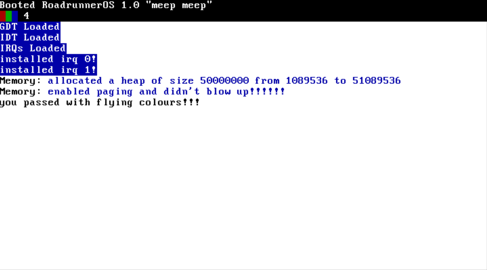

# RoadrunnerOS

## what?
a simple x86 kernel

## why?
just for fun

## how?
- install gcc-elf-i686
- `git clone https://github.com/rtreccani/RoadRunnerOS.git`
- `cd RoadRunnerOS`
- `./generate.sh -bin` for qemu in bin mode (no bootloader)
- `./generate.sh -grub` for qemu in grub mode (builds the bin into a simple bootloader)
- `./generate.sh -bochs` for bochs in grub mode (good for debugging)

## Status?
- [x] interrupt handling
- [x] basic segmentation
- [x] text mode
- [x] physical memory allocator
- [x] address virtualisation
- [ ] vga mode
- [ ] multi-tasking
- [ ] long mode
- [ ] syscalls